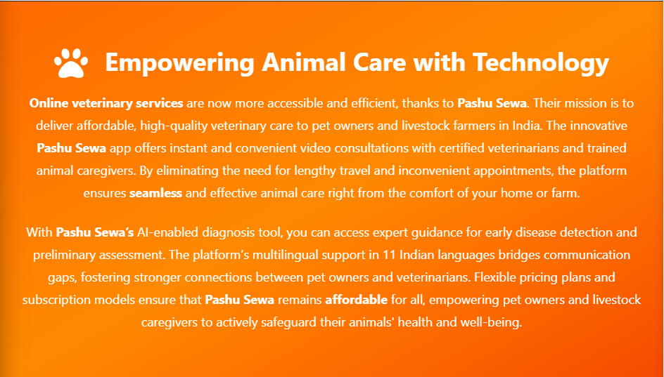
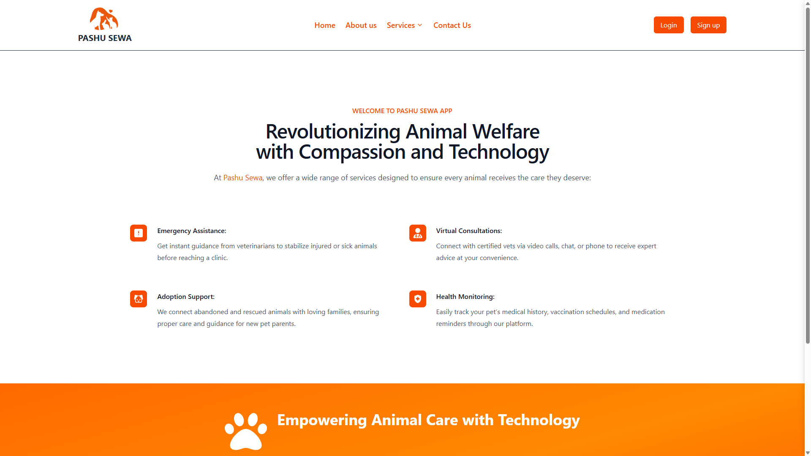
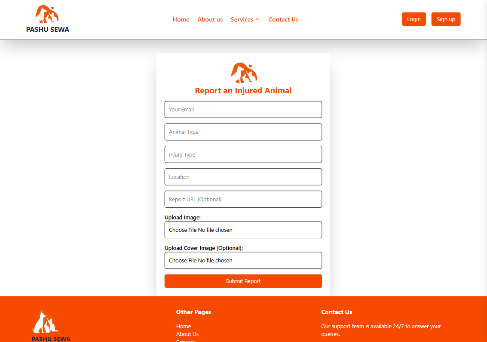
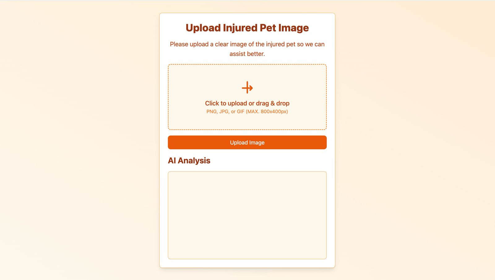
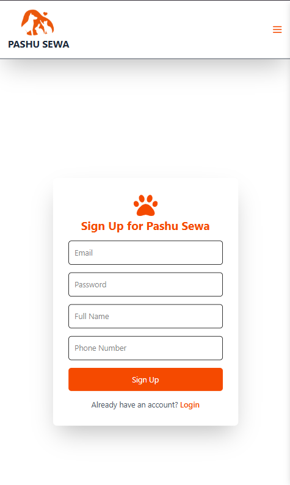
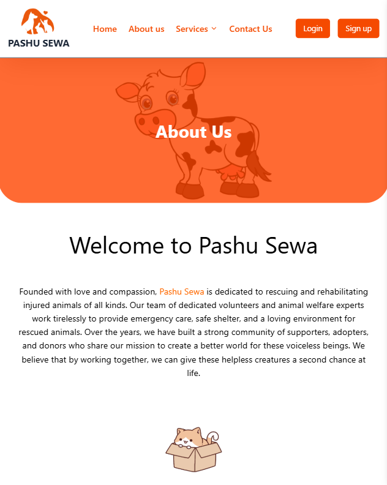
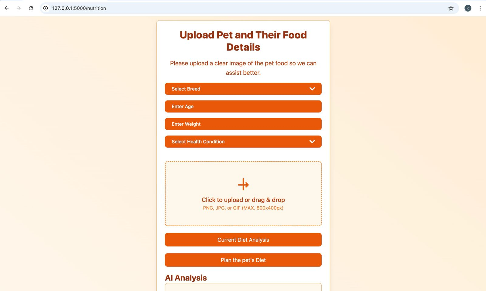

# Pashu Sewa



## Project Overview
**Pashu Sewa** is an animal welfare platform designed to help injured and stray animals by enabling users to report cases and donate for their treatment. The platform leverages Web3 technology to reward users with ERC20 tokens for each valid injury report. The project includes both a web and an Android version, ensuring accessibility for a wider audience.

### Problem Solved
Stray and injured animals often do not receive timely care due to a lack of awareness and funding. **Pashu Sewa** addresses this issue by providing a seamless reporting system and encouraging contributions through a transparent and blockchain-backed donation system.

### Key Features
- **Animal Injury Reporting**: Users can report injured animals by uploading images and providing location details.
- **Donations**: People can contribute to the treatment of reported animals.
- **Web3 Integration**: Rewards users with ERC20 tokens for each verified report.
- **User Authentication**: Secure authentication system to prevent spam reports.
- **Admin Dashboard**: Admins can verify reports and track donations.
- **Multi-Platform Support**: Web-based and Android versions for ease of access.

---

## Deployed Link
🔗 [Live Demo](http://pashusewa.netlify.app)

## Video Demo
🎥 [Watch Demo-1](https://drive.google.com/file/d/1DAhWFz6tYYbJPA9pz8D9ozUt23D7qWUj/view?usp=drivesdk)
🎥 [Watch Demo-2](https://drive.google.com/file/d/1mOLAd2-X1DQwDLqEdbraBhbnr4DxM6GY/view?usp=drivesdk) 

---

## Dependencies
Ensure you have the following dependencies installed to run the project:

### Backend (Node.js + Express)
- **Node.js**: 18.x
- **Express**: 4.x
- **MongoDB**: 6.x
- **Mongoose**: 6.x
- **Web3.js**: 1.8.x
- **Dotenv**: 16.x
- **Multer**: 1.4.x (for image uploads)
- **Cloudinary**: 1.32.x (for storing images)

### Frontend (React)
- **React**: 18.x
- **Vite**: 5.x
- **Axios**: 1.x
- **Tailwind CSS**: 3.x
- **React Router**: 6.x

### Mobile (React Native)
- **React Native**: 0.72.x
- **Expo**: 49.x

### Blockchain (Smart Contracts)
- **Solidity**: 0.8.x
- **Hardhat**: 2.x
- **Ethers.js**: 6.x
- **MetaMask Wallet** for testing

---

## Setup Instructions

### 1. Clone the Repository
```sh
git clone https://github.com/yourusername/pashu-sewa.git
cd pashu-sewa
```

### 2. Backend Setup
```sh
cd backend
npm install
```

#### Environment Variables (.env)
Create a `.env` file in the backend directory and add:
```sh
PORT=5000
MONGO_URI=your_mongodb_connection_string
CLOUDINARY_URL=your_cloudinary_api_url
WEB3_INFURA_PROJECT_ID=your_infura_project_id
PRIVATE_KEY=your_erc20_smart_contract_private_key
```

Run the backend server:
```sh
npm start
```

### 3. Frontend Setup
```sh
cd frontend
npm install
npm run dev
```

### 4. Mobile App Setup
```sh
cd mobile
npm install
npx expo start
```

### 5. Deploying Smart Contract
```sh
cd blockchain
npm install
npx hardhat run scripts/deploy.js --network goerli
```

---

## Usage
- **Report an Injury**: Users upload a picture, location, and details.
- **Donate**: People can contribute via UPI, PayPal, or crypto.
- **Earn Tokens**: Verified reports get ERC20 token rewards.
- **Track Reports**: Users can monitor reported cases and donations.

For any issues, feel free to create an issue on GitHub or contact us!

---

## License
This project is licensed under the **MIT License**.

---

## Screenshots
### Home Page


### Report Form


### AI Powered Injury Detector


### Signup Form


### About Page


### AI Powered Diet Planner

